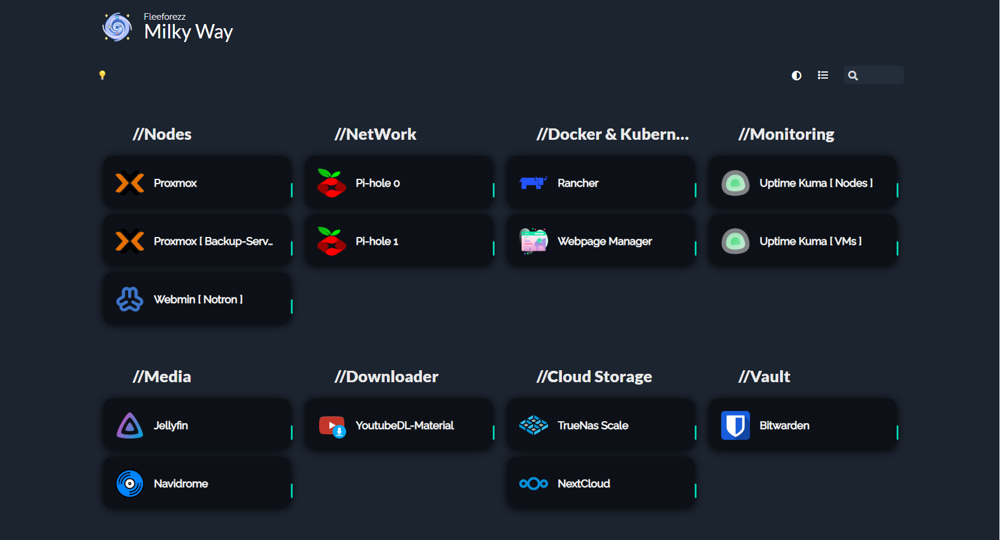

<h1 align="center">
    
    <br>
    Homer
</h1>
<h3 align="center">
    A simple and beautiful design 🔆 for home dashboard
    <br>
    <a>Visit Homer in github</a>
</h3> 
<br>


# 🐣 Getting ready
Required :
+ [Docker]() 
+ [Docker Compose]()
+ [Portainer]()
+ [Git Command]()
# 🔰 Install
## Using docker-compose and git clone <sup>*[docker + git]*</sup>
**Required** :
+ [Git Command]()
+ [Docker]()
+ [Docker Compose]()
> Install files from github 
```
git clone https://github.com/fleeforezz/Homer-Modified.git
```
> Open Homer-Modified file
```
cd Homer-Modified
```
> Take a look inside the docker-compose.yml file
<br>

You can edit host path or ports in docker ✏️

```yml
---
version: "3.9"
services:
  homer:
      image: b4bz/homer:22.02.1 # Have to use this version in oder to work fine
      container_name: homer
      volumes:
        - /home/nhat/Homer/data:/www/assets
      ports:
        - 8092:8080
      #environment:
      #  - UID=1000
      #  - GID=1000
      restart: unless-stopped
```
> Run docker-compose.yml file
```
docker-compose up -d
```


## Using Portainer <sup>*[Docker]*</sup>
**Required** :
+ [Docker]()
+ [Docker Compose]()
+ [Portainer]()
> Install Portainer
```dockerfile
    docker run -d \
              --name="portainer" \
              --restart on-failure \
              -p 9000:9000 \
              -p 8000:8000 \
              -v /var/run/docker.sock:/var/run/docker.sock \
              -v portainer_data:/data \
                portainer/portainer-ce:latest
```
<br>

After you finished installing Portainer head to [ http://yourip:9000 ]
<br>

1. Choose your **environment** ( usually local )
2. Choose **stack**
3. Create a new **stack**
4. Name the stack and click on Git **Repository** :
    - Repository URL : [ https://github.com/fleeforezz/Homer-Modified.git ]
    - Repository reference : refs/heads/branch_name ( usually main )
<br>

If everything setup correctly **Deploy the stack** 😊
<br>
Enter this link 🔗 to jump over your Homer Dashboard [ http://yourip:8092 ]

# 🗑️ Uninstall Homer
## Using docker-compose and git clone <sup>*[docker + git]*</sup>
> Remove running docker
```
docker ps
```
```
docker stop [image-Name]
```
> Remove docker images
```
docker images
```
```
docker rmi -f [image-ID]
```
> Finally, remove the git repo you have install earlier
```
rm -r /path/Homer-Modified
```

## Using Portainer <sup>[Docker]</sup>
Simply you just have to remove the stack and image in Portainer
